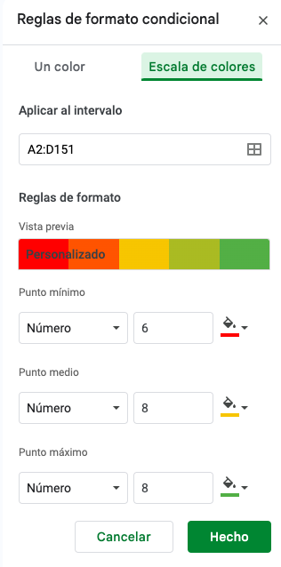

# Formatos

En las celdas podemos poner tanto texto como números

Los numeros pueden tener decimales y en idioma español hay que usar la ',' coma decimal no el punto

Los números pueden tener un formato más complejo, por ejemplo moneda (se asumen 2 decimales) o % (Al usar un % no hace falta dividir por 100 en los cálculos)

## Formatos del valor de las celdas

Texto
Numérico
Fecha (y sus subformatos)
Moneda
%

## Precisión y cifras decimales
Podemos definir los decimales que vamos a usar

## Formato visual

Se puede configurar que el tamaño de la celda se adapte al contenido y que se alinee a alguna forma

* Texto
* Colores
* Bordes

Copiar y pegar formato

## Formateo condicional

Seleccionamos las condiciones que determinarán el aspecto de la opción "Formateo condicional".
Podemos poner varias de ellas en una misma casilla
Cuando copiamos el formato se traslada también

