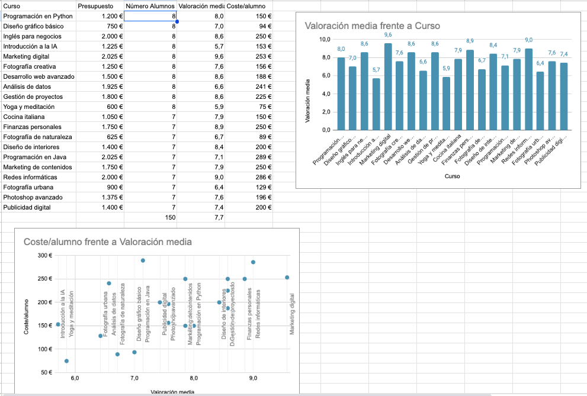

## Importación de datos

### Importación de datos

Opción Importar

* Creación de nuevos documentos, nuevas hojas
* Formatos de documentos
* Separadores

### Vinculación de datos

* Diferencia entre importar y vincular

Accedemos a los datos pero sin hacer copia
Ventaja: están actualizados
Desventaja: pueden desaparecer si el original lo hace

#### En un mismo documento

Podemos hacerlo con el ratón cambiando de Hoja

La referencia tiene el formato "Hoja"!A1:D5

#### En otro documento

Usamos la función IMPORTRANGE 

IMPORTRANGE("https://docs.google.com/spreadsheets/d/abcd123abcd123", "sheet1!A1:C10")

IMPORTRANGE(A2,"B2")

IMPORTRANGE(A2,B2)

O damos permiso por adelantado o nos aparecerá la ventana

Se puede importar desde diferentes formatos: HTML, FEEDs o de la URL de un fichero

Ejemplo:

=IMPORTRANGE("https://docs.google.com/spreadsheets/d/1eihSTkbIm4vRQKcQm2sdSpKbKuAPYxb0sPyJmW7UHhE/edit?usp=sharing";"Profesores!A1:A8")

Podemos usar como si fuera un rango, en una búsqueda por ejemplo

=BUSCAR(D2;IMPORTRANGE("https://docs.google.com/spreadsheets/d/1eihSTkbIm4vRQKcQm2sdSpKbKuAPYxb0sPyJmW7UHhE/edit?usp=sharing";"Profesores!A1:A8");IMPORTRANGE("https://docs.google.com/spreadsheets/d/1eihSTkbIm4vRQKcQm2sdSpKbKuAPYxb0sPyJmW7UHhE/edit?usp=sharing";"'Profesores'!D1:D8"))

Ya que podemos usar el valor de una celda, podemos tener una hoja con "configuración" con el enlace, que así podríamos modificar

[Documentación: IMPORTRANGE](https://support.google.com/docs/answer/3093340?sjid=13943642771072787424-EU)

[Documentación: Reference data from other sheets](https://support.google.com/docs/answer/75943?hl=en&co=GENIE.Platform%3DDesktop#:~)

### Ejemplo de agregación de datos

1. Importamos nombres de cursos
=IMPORTRANGE("https://docs.google.com/spreadsheets/d/1UjBiN_i6fJUGvwanXLsJsWhYXs3AGBFSzK35gnmiwCI/edit?usp=sharing";"Cursos!A2:A21")
1. Importamos presupuestos
=IMPORTRANGE("https://docs.google.com/spreadsheets/d/1UjBiN_i6fJUGvwanXLsJsWhYXs3AGBFSzK35gnmiwCI/edit?usp=sharing";"Cursos!E2:E21")
1. Contamos los alumnos por curso
=CONTAR.SI(valoraciones!B$1:B151;"="&A2)
1. Calculamos la valoración promedio
=PROMEDIO(FILTER(valoraciones!C$1:C$141;valoraciones!B$1:B$141=A2))
1. Coste medio por alumno
=B2/C2
1. Creamos gráfico de barras
1. Creamos gráfico de dispersión
    * Añadimos etiquetas

